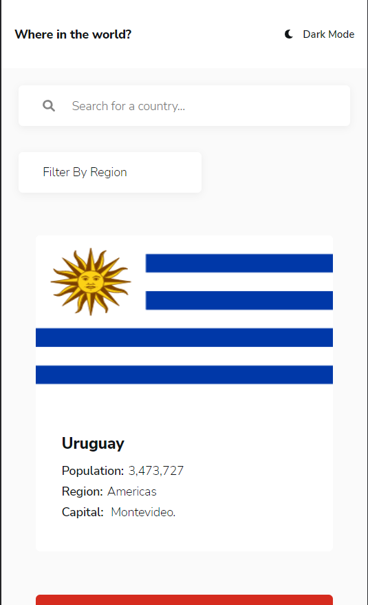
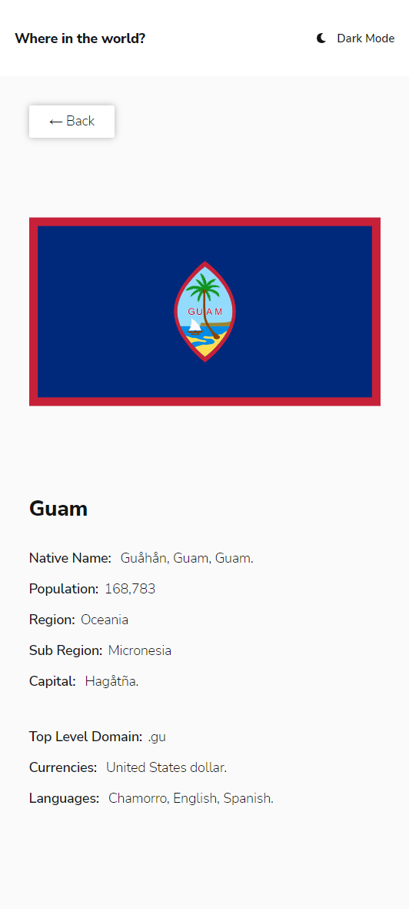
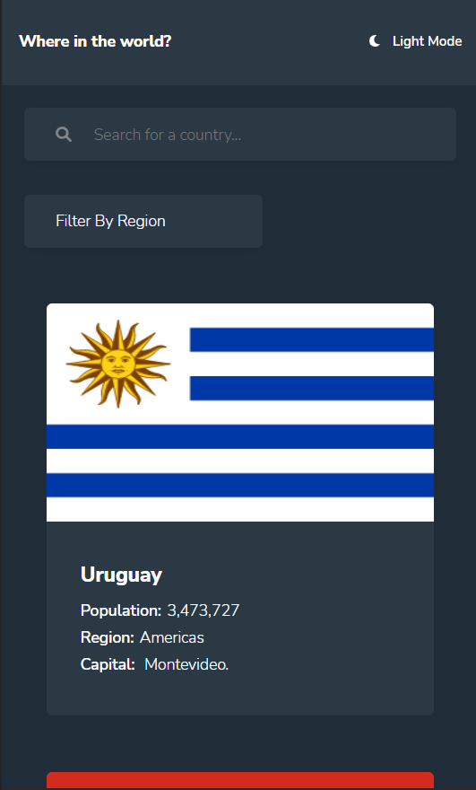
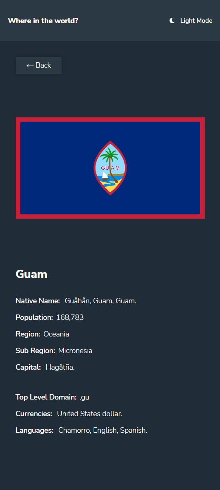
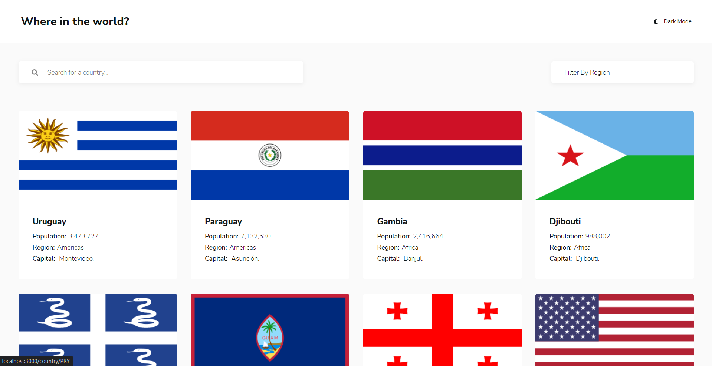
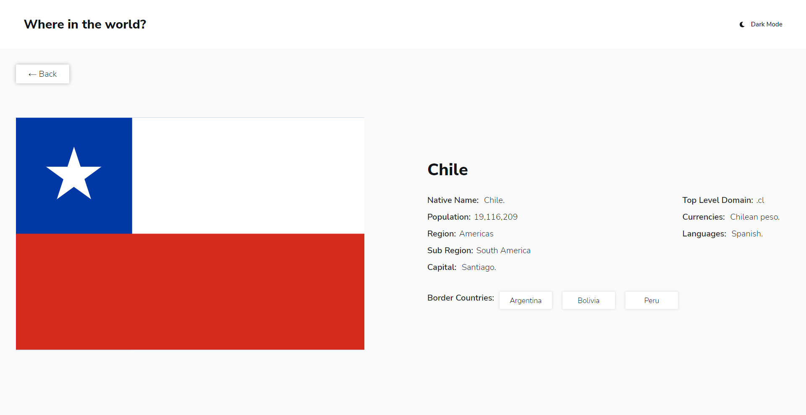
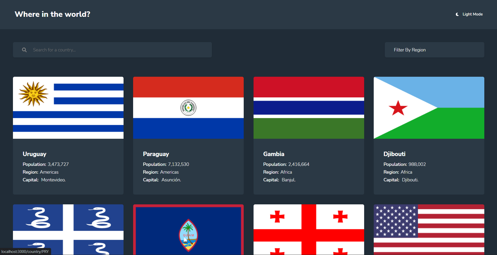
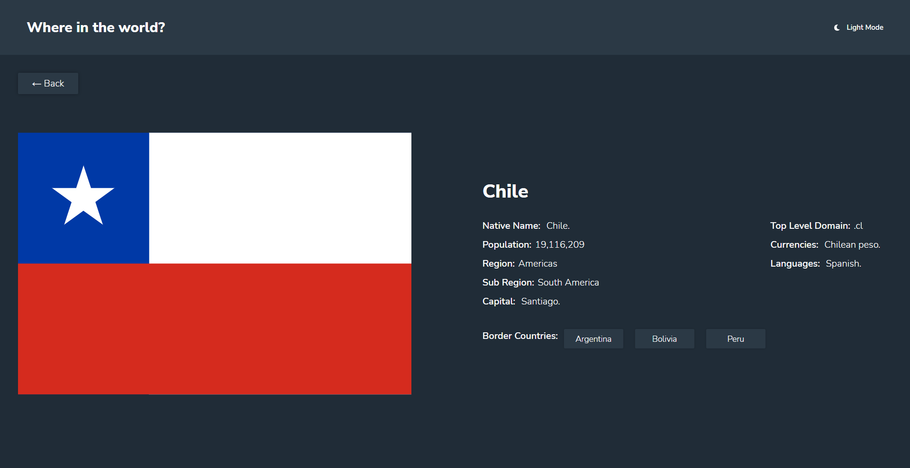

# Frontend Mentor - REST Countries API with color theme switcher solution

This is a solution to the [REST Countries API with color theme switcher challenge on Frontend Mentor](https://www.frontendmentor.io/challenges/rest-countries-api-with-color-theme-switcher-5cacc469fec04111f7b848ca). Frontend Mentor challenges help you improve your coding skills by building realistic projects. 

## Table of contents

- [Overview](#overview)
  - [The challenge](#the-challenge)
  - [Screenshot](#screenshot)
  - [Links](#links)
- [My process](#my-process)
  - [Built with](#built-with)
  - [What I learned](#what-i-learned)
  - [Continued development](#continued-development)
  - [Useful resources](#useful-resources)
- [Author](#author)
- [Acknowledgments](#acknowledgments)

## Overview

### The challenge

Users should be able to:

- See all countries from the API on the homepage
- Search for a country using an `input` field
- Filter countries by region
- Click on a country to see more detailed information on a separate page
- Click through to the border countries on the detail page
- Toggle the color scheme between light and dark mode *(optional)*

### Screenshot

### Links

- Solution URL: [Solution](https://www.frontendmentor.io/solutions/country-rest-api-with-react-styled-components-router-and-typescript-HJdfee3Uq)
- Live Site URL: [Live site](https://mata-where-in-the-world.vercel.app/)

## My process

### Built with

- [React](https://reactjs.org/) - JS library
- React Router
- [Styled Components](https://styled-components.com/) - For styles
- Typescript
- Flexbox
- CSS Grid
- Mobile-first workflow

### What I learned

I was able to refresh myself on my knowledge of working with React and hooks.
Also, was able to work with Typescript, React Router and styled components libraries.

I was able to know a way to store data in the localstorage to save on making many calls to the 
server. This saved the user bandwidth and reduced the load to the server.

I was able to learn on how to make a theme toggle for a site.

## Author

- Frontend Mentor - [@DonMatano](https://www.frontendmentor.io/profile/DonMatano)
- Twitter - [@MMatano5](https://www.twitter.com/mmatano5)
